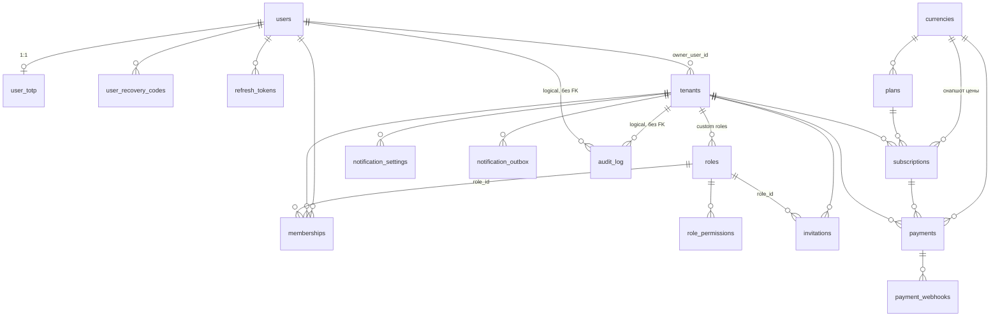

# Фаза 0 — Схема БД ядра

> Статус: утверждена владельцем 2026-07-06 (реестр решений — `00-open-questions.md`; решённые пункты §5 аннотированы). PostgreSQL 16. Только scope v1: auth, tenants, billing (Payme, Click), notifications (Telegram, SMS Eskiz, email), audit, admin-каркас. Модуль commerce таблиц здесь не имеет — но конвенции §4 гарантируют, что он сядет поверх без изменений ядра.

## 1. Обзор

### 1.1 ER-диаграмма (основные связи)



### 1.2 Классификация таблиц

| Тип | Таблицы | RLS |
|-----|---------|-----|
| Глобальные (без `tenant_id`) | `users`, `user_totp`, `user_recovery_codes`, `refresh_tokens`, `currencies`, `plans`, `processed_events` | нет (защита на уровне сервисов, см. §3.5 и откр. вопрос №9; `processed_events` — служебная, §2.7) |
| Тенантные (`tenant_id NOT NULL`) | `memberships`, `invitations`, `subscriptions`, `payments`, `notification_settings` | да |
| Гибридные (`tenant_id NULL` = системная строка) | `roles`, `role_permissions` (через роль), `notification_outbox`, `payment_webhooks`, `audit_log` | да, политика с учётом NULL |
| Особая | `tenants` (сама является тенантом) | да, политика по `id` |

Обоснования глобальности — в описаниях таблиц.

### 1.3 Принципы

**PK — UUIDv7, генерируется в приложении.** Тип колонки `uuid`. Обоснование выбора против `bigint identity`:
- ID известен до INSERT — нужен для корреляции событие шины ↔ outbox ↔ audit в одной транзакции без round-trip;
- не перечисляется (не помогает IDOR-атакам), безопасен в URL и вебхуках (`merchant_trans_id` для Click);
- UUIDv7 монотонен по времени → локальность B-tree-индекса почти как у bigint, проблема случайных UUIDv4 отсутствует;
- шаблон порождает десятки проектов — отсутствие координации последовательностей упрощает переносы данных и слияния.
Цена — 16 байт вместо 8; для наших объёмов приемлемо. PG16 не имеет нативного `uuidv7()` (появился в PG18), поэтому генерация в приложении (библиотека `uuid-utils`); в БД default на PK нет — колонка `NOT NULL` без default. Исключение: `currencies` — естественный ключ `char(3)`.

**Деньги.** Только `bigint` в минимальных единицах валюты + колонка `currency char(3)` (ISO 4217, default `'UZS'`) с FK на справочник `currencies(code, exponent)`. Никаких float/numeric для сумм. Экспоненты: **UZS = 0** (тийины в обороте не используются — сознательное отступление от номинального ISO-значения 2, зафиксировано мастер-промптом), USD = 2.

**created_at / updated_at.** Конвенция: каждая таблица имеет `created_at timestamptz NOT NULL DEFAULT now()` и `updated_at timestamptz NOT NULL DEFAULT now()` (обновляется приложением через SQLAlchemy `onupdate`, без триггеров). Исключения: `audit_log` — append-only, только `created_at`; `processed_events` (§2.7) — неизменяемые строки дедупликации шины, только `processed_at`. Ниже в описаниях таблиц эти две колонки **не повторяются** — они подразумеваются конвенцией. Все времена — UTC, тип всегда `timestamptz`.

**Naming conventions.**
- Таблицы: snake_case, множественное число (`payments`); ядро — без префиксов; таблицы фич модулей — см. §4 и открытый вопрос №1.
- Колонки: snake_case; FK — `<entity>_id`; временные метки — `*_at`; булевы — `is_*`; хэши — `*_hash`; шифрованное — `*_encrypted`.
- Constraints (задаётся `naming_convention` в SQLAlchemy MetaData, чтобы Alembic был детерминирован): `pk_<table>`, `fk_<table>_<column>_<reftable>`, `uq_<table>_<columns>`, `ix_<table>_<columns>`, `ck_<table>_<name>`.

**Enum-стратегия.** Нативные PG-enum не используются (болезненные миграции). Правило:
- статусы жизненного цикла, которыми владеет ядро (`payments.status`, `subscriptions.status`, …) — `text` + именованный `CHECK`;
- расширяемые справочники (`provider`, `channel`, `action`, `template_key`, `locale`, `purpose`) — `text` **без** CHECK, валидация реестром в приложении. Иначе подключение нового платёжного адаптера или канала в клиентском проекте требовало бы миграции ядра.

**Soft delete: нет универсального `deleted_at`.** Решение:
- по умолчанию — жёсткое удаление; факт удаления фиксируется в `audit_log`;
- `tenants` — единственная таблица со статусным жизненным циклом вместо удаления (`active`/`suspended`/`deleted`): на тенанта ссылается финансовая история. **Инвариант схемы: тенант никогда не удаляется DELETE'ом — только сменой статуса.** Все FK на `tenants` — `ON DELETE RESTRICT` (второй страховочный ремень: даже ручной DELETE от владельца схемы не снесёт молча membership'ы и журналы);
- `users` — статус `blocked` + жёсткое удаление (право на забвение), разрешённое, если пользователь не владеет тенантами (RESTRICT по `tenants.owner_user_id`); детали — §2.1;
- финансовые и журнальные таблицы (`payments`, `subscriptions`, `payment_webhooks`, `audit_log`) не удаляются никогда: FK с `ON DELETE RESTRICT` + роли приложения не получают привилегию `DELETE` (см. §3.4).
Обоснование: сквозной soft delete заражает каждый запрос фильтром и ломает UNIQUE-ограничения (нужны partial-индексы везде); выгода для шаблона не окупает сложность.

**Postgres vs Redis (общий принцип).** Postgres — всё, что является источником правды и обязано пережить рестарт/failover (refresh-токены, коды восстановления, outbox уведомлений, платежи). Redis — эфемерное с TTL и высокой частотой записи, потеря которого деградирует мягко (rate limiting, счётчики перебора, одноразовые короткоживущие токены). Детали — §2.1.

---

## 2. Блоки ядра

### 2.1 auth

**Решение: users глобальные** (вынесено на утверждение — откр. вопрос №9, это сознательное отступление от буквы «tenant_id во всех бизнес-таблицах» мастер-промпта). Один email — один аккаунт на всю инсталляцию; связь с организациями — через `memberships` с ролью. Обоснование: типовой сценарий рынка — один человек в нескольких организациях (владелец двух магазинов, бухгалтер на аутсорсе); per-tenant users порождают дубли личности, ад с 2FA и невозможность «переключить организацию» без повторного входа. Refresh-токены, TOTP и коды восстановления следуют за user — тоже глобальные (принадлежность — пользователю, не организации).

#### users
Учётная запись человека. Глобальная: личность существует вне тенантов.

| Колонка | Тип | Nullable | Default | Описание |
|---|---|---|---|---|
| id | uuid | no | — | PK, UUIDv7 из приложения |
| email | text | no | — | нормализуется в lower в приложении |
| email_verified_at | timestamptz | yes | NULL | NULL = не подтверждён |
| password_hash | text | no | — | только argon2id (формат PHC-строки) |
| full_name | text | yes | NULL | |
| phone | text | yes | NULL | E.164; для SMS-уведомлений, не для входа |
| locale | text | no | 'ru' | 'ru' / 'uz'; валидация в приложении |
| is_superuser | boolean | no | false | платформенный стафф; см. блок admin |
| status | text | no | 'active' | CHECK: 'active','blocked' |
| last_login_at | timestamptz | yes | NULL | |

- PK: `id`. UNIQUE: функциональный уникальный индекс `uq_users_email_lower` по `lower(email)` — регистронезависимая уникальность без зависимости от расширения citext (переносимость шаблона на managed PG).
- Индексы: только `uq_users_email_lower` (он же — поиск при входе).
- Удаление user (право на забвение по закону УЗ о персданных): жёсткое, разрешено, если пользователь не владеет тенантами (`tenants.owner_user_id` → RESTRICT); membership/токены/2FA каскадируются. Операция удаления дополнительно чистит ПД за пределами каскада: строки `notification_outbox` с `recipient`, совпадающим с email/phone пользователя, и `invitations.email` по точному совпадению; `audit_log` хранит только его uuid (не ПД). Остальное покрывает ретенция outbox/invitations (§2.4, §2.2). См. открытый вопрос №6.

#### user_totp
2FA TOTP, 1:1 с user. Отдельная таблица, а не колонки в users: секрет — самое чувствительное поле, отдельная таблица сужает выборки и упрощает право доступа.

| Колонка | Тип | Nullable | Default | Описание |
|---|---|---|---|---|
| user_id | uuid | no | — | PK, FK → users ON DELETE CASCADE |
| secret_encrypted | bytea | no | — | TOTP-секрет, шифрование на уровне приложения (AES-GCM/Fernet, ключ из env; ротация ключа — MultiFernet без миграции схемы) |
| confirmed_at | timestamptz | yes | NULL | NULL = enrollment не завершён; 2FA включена ⇔ NOT NULL |

- PK: `user_id`. Индексы: не нужны (доступ только по PK).

#### user_recovery_codes
Backup-коды 2FA. Одна строка — один код, одноразовый.

| Колонка | Тип | Nullable | Default | Описание |
|---|---|---|---|---|
| id | uuid | no | — | PK |
| user_id | uuid | no | — | FK → users ON DELETE CASCADE |
| code_hash | text | no | — | SHA-256; коды генерируются с энтропией ≥ 64 бит, поэтому медленный хэш не нужен |
| used_at | timestamptz | yes | NULL | NULL = не использован |

- Индексы: `ix_user_recovery_codes_user_id` (выборка кодов пользователя при проверке и перевыпуске).

#### refresh_tokens
Refresh-токены с ротацией, отзывом и семействами для детекта повторного использования. В Postgres, не в Redis: отзыв — security-критичное состояние, обязан пережить рестарт Redis.

| Колонка | Тип | Nullable | Default | Описание |
|---|---|---|---|---|
| id | uuid | no | — | PK |
| user_id | uuid | no | — | FK → users ON DELETE CASCADE |
| family_id | uuid | no | — | назначается при входе; вся цепочка ротаций — одно семейство |
| token_hash | text | no | — | SHA-256 сырого токена (токен — 256 бит энтропии, argon2 избыточен); сырой токен нигде не хранится |
| expires_at | timestamptz | no | — | |
| rotated_at | timestamptz | yes | NULL | момент обмена на потомка |
| revoked_at | timestamptz | yes | NULL | явный отзыв |
| revoked_reason | text | yes | NULL | 'logout','reuse_detected','admin','password_change' |
| ip | inet | yes | NULL | контекст выдачи/использования токена: расследование инцидентов reuse-детекта, материал для audit-событий |
| user_agent | text | yes | NULL | то же |

- UNIQUE: `uq_refresh_tokens_token_hash`.
- Индексы: `token_hash` (уникальный — поиск при refresh), `ix_refresh_tokens_user_id` (массовый отзыв всех токенов пользователя — побочный эффект change_password/reset_password, интерфейсы §3.1; экрана «мои сессии» в v1 нет), `ix_refresh_tokens_family_id` (отзыв семейства при детекте reuse), `ix_refresh_tokens_expires_at` (retention-джоба чистки протухших).
- **Протокол ротации — атомарный CAS, гонка исключена на уровне БД.** Ротация выполняется одним оператором:
  ```sql
  UPDATE refresh_tokens
     SET rotated_at = now()
   WHERE id = :id AND rotated_at IS NULL AND revoked_at IS NULL
         AND expires_at > now()
  RETURNING id;
  ```
  Победитель (1 строка) в той же транзакции вставляет токен-потомок с тем же `family_id`. Проигравший параллельный запрос получает 0 строк — два живых потомка от одного токена невозможны.
- Детект reuse: предъявлен токен с `rotated_at IS NOT NULL` или `revoked_at IS NOT NULL` (включая проигравшего CAS) → трактуется как reuse → отзыв всего семейства (`revoked_reason = 'reuse_detected'`) + событие в audit. Политика по отношению к легитимным сетевым ретраям клиента (строгий отзыв vs grace-период) — открытый вопрос №10.

#### Что живёт в Redis (auth)
Postgres здесь не участвует — обоснование: всё ниже эфемерно, имеет TTL, пишется на каждый запрос (счётчики) и его потеря безопасно деградирует (сбросился лимит — не сломалась аутентификация). Ни одна из этих сущностей не является источником правды.

| Ключ | TTL | Назначение |
|---|---|---|
| `rl:{scope}:{key}` | окно лимита | rate limiting (атомарный INCR) |
| `auth:fail:{user_id}` / `auth:lock:{user_id}` | окно/время блокировки | счётчик неудачных входов, экспоненциальная блокировка перебора |
| `auth:pwreset:{token_hash}` | ~1 ч | одноразовый токен сброса пароля |
| `auth:verify:{token_hash}` | ~24 ч | одноразовый токен подтверждения email |
| `auth:2fa:{challenge_id}` | ~5 мин | промежуточный челлендж между паролем и TOTP |
| `auth:totp_used:{user_id}:{code}` | 90 с | анти-replay уже принятого TOTP-кода |

Access JWT — stateless, в БД не хранится (короткий TTL ~10 мин); denylist по jti в v1 не делаем (см. открытый вопрос №5).

### 2.2 tenants

**RBAC-решение.** Каталог permission codes — **в коде**, не в таблице: эндпоинты декларируют права константами (`require_permission("billing.subscription:manage")`), и таблица неизбежно расходилась бы с кодом. Роли — в БД: системные (`tenant_id IS NULL`, `is_system = true`: owner, admin, member) + кастомные per-tenant. Гранты системных ролей тоже описаны в коде и на старте идемпотентно синхронизируются в `role_permissions` — чтобы admin-API читал права любой роли одним способом. Старт приложения падает, если в `role_permissions` встречается код, отсутствующий в реестре.

#### tenants
Организация — единица мультитенантности. Глобальная по природе (реестр самих тенантов).

| Колонка | Тип | Nullable | Default | Описание |
|---|---|---|---|---|
| id | uuid | no | — | PK |
| name | text | no | — | отображаемое имя |
| slug | text | no | — | латиница/цифры/дефис, хранится в lower; для URL и поддоменов |
| owner_user_id | uuid | no | — | FK → users ON DELETE RESTRICT; единственный владелец гарантирован самой колонкой |
| status | text | no | 'active' | CHECK: 'active','suspended','deleted' (архив вместо жёсткого удаления — финансовая история) |
| default_locale | text | no | 'ru' | локаль по умолчанию для уведомлений |

- UNIQUE: `uq_tenants_slug`. Индексы: `ix_tenants_owner_user_id` (проверка RESTRICT при удалении user, «мои владения»).
- Инвариант приложения: владелец всегда имеет membership с системной ролью owner; смена владельца — атомарная операция сервиса (колонка + membership).
- Создание тенанта (регистрация организации + первый owner-membership) — кросс-тенантная операция через `app_maintenance` (§3.4): в момент INSERT тенантного контекста ещё нет. Обновление тенанта владельцем/админом — обычный путь `app_user` (политика `tenant_self_update`, §3.3).

#### memberships
Связь user ↔ tenant с ролью. Тенантная.

| Колонка | Тип | Nullable | Default | Описание |
|---|---|---|---|---|
| id | uuid | no | — | PK |
| tenant_id | uuid | no | — | FK → tenants ON DELETE RESTRICT |
| user_id | uuid | no | — | FK → users ON DELETE CASCADE |
| role_id | uuid | no | — | FK → roles ON DELETE RESTRICT (роль в использовании не удалить) |
| status | text | no | 'active' | CHECK: 'active','suspended' |

- UNIQUE: `uq_memberships_tenant_id_user_id` (один membership на пару; он же — поиск «права юзера в тенанте» на каждый запрос).
- Индексы: `ix_memberships_user_id` («мои организации» при входе), `ix_memberships_role_id` (проверка RESTRICT, «кто с ролью X»).

#### roles
Гибридная: системные роли шаблона (`tenant_id IS NULL`) + кастомные роли тенанта.

| Колонка | Тип | Nullable | Default | Описание |
|---|---|---|---|---|
| id | uuid | no | — | PK |
| tenant_id | uuid | yes | NULL | NULL = системная; иначе FK → tenants ON DELETE RESTRICT |
| code | text | no | — | 'owner','admin','member' у системных; slug у кастомных |
| name | text | no | — | отображаемое имя |
| is_system | boolean | no | false | системные нельзя менять/удалять из admin-API |

- UNIQUE: `uq_roles_tenant_id_code` — **`UNIQUE NULLS NOT DISTINCT (tenant_id, code)`** (PG16): исключает две системные роли с одним code.
- Индексы: `ix_roles_tenant_id` (список ролей тенанта).

#### role_permissions
Гранты роли. Коды прав — text, ссылаются на реестр в коде.

| Колонка | Тип | Nullable | Default | Описание |
|---|---|---|---|---|
| role_id | uuid | no | — | FK → roles ON DELETE CASCADE |
| permission_code | text | no | — | напр. 'commerce.order:read' |

- PK: составной `(role_id, permission_code)` — он же покрывает выборку прав роли. `tenant_id` не дублируем: RLS через EXISTS к `roles` (§3.3), таблица доступна только сервису RBAC. Политики записи не позволяют `app_user` трогать гранты системных ролей (§3.3) — их синхронизирует только код старта через `app_maintenance`.

#### invitations
Приглашение в организацию по email. Тенантная.

| Колонка | Тип | Nullable | Default | Описание |
|---|---|---|---|---|
| id | uuid | no | — | PK |
| tenant_id | uuid | no | — | FK → tenants ON DELETE RESTRICT |
| email | text | no | — | lower в приложении |
| role_id | uuid | no | — | FK → roles ON DELETE RESTRICT |
| token_hash | text | no | — | SHA-256 одноразового токена из ссылки |
| status | text | no | 'pending' | CHECK: 'pending','accepted','revoked','expired' |
| invited_by_user_id | uuid | yes | — | FK → users ON DELETE SET NULL |
| accepted_by_user_id | uuid | yes | NULL | FK → users ON DELETE SET NULL |
| expires_at | timestamptz | no | — | default в приложении: +7 дней |
| accepted_at | timestamptz | yes | NULL | |

- UNIQUE: `uq_invitations_token_hash`; partial unique `uq_invitations_pending_email` по `(tenant_id, lower(email)) WHERE status = 'pending'` — не более одного активного приглашения на адрес.
- Индексы: `token_hash` (переход по ссылке), `ix_invitations_tenant_id_status` (список приглашений в админке), `ix_invitations_role_id` (RESTRICT).
- Ретенция ПД: терминальные приглашения (`accepted`/`revoked`/`expired`) удаляются свипом `app_maintenance` через N дней (default 90, env) — email не живёт в таблице бессрочно (см. откр. вопрос №6).

### 2.3 billing

#### currencies
Справочник валют с экспонентами — явно в scope v1. Глобальный справочник: свойства валюты не зависят от тенанта.

| Колонка | Тип | Nullable | Default | Описание |
|---|---|---|---|---|
| code | char(3) | no | — | PK, ISO 4217 ('UZS','USD') |
| exponent | smallint | no | — | UZS=0, USD=2; CHECK: 0–4 |
| name | text | no | — | английское название |

- Seed в миграции: UZS(0), USD(2) — с рабочим downgrade (§3.6). Добавление валюты — insert, не изменение схемы.

#### plans
Каталог тарифных планов. **Решение: глобальный** (без tenant_id): планы — продукт самой инсталляции, их покупают тенанты; per-tenant планы означали бы, что тенант продаёт сам себе. Индивидуальные условия — вопрос будущего (бэклог, поле скидки в subscription при потребности).

| Колонка | Тип | Nullable | Default | Описание |
|---|---|---|---|---|
| id | uuid | no | — | PK |
| code | text | no | — | стабильный идентификатор ('start','pro') |
| name | jsonb | no | — | локализованное имя: `{"ru": "...", "uz": "..."}` |
| description | jsonb | yes | NULL | локализованное описание |
| price_amount | bigint | no | — | minor units; CHECK ≥ 0 (0 = бесплатный) |
| currency | char(3) | no | 'UZS' | FK → currencies ON DELETE RESTRICT |
| period | text | no | 'month' | CHECK: 'month','year' |
| trial_days | smallint | no | 0 | 0 = без триала |
| is_active | boolean | no | true | false = архив, недоступен для новых подписок |

- UNIQUE: `uq_plans_code`. Индексы: не нужны (таблица на десятки строк). Лимиты/фичи тарифов — модуль saas из бэклога, сюда не кладём.

#### subscriptions
Подписка тенанта на план. Тенантная. Хранит **снапшот цены**: изменение `plans.price_amount` не меняет условия живых подписок задним числом; актуальная цена плана копируется в подписку при создании и при каждом продлении периода (взаимодействует с откр. вопросом №4).

| Колонка | Тип | Nullable | Default | Описание |
|---|---|---|---|---|
| id | uuid | no | — | PK |
| tenant_id | uuid | no | — | FK → tenants ON DELETE RESTRICT (финансовая история) |
| plan_id | uuid | no | — | FK → plans ON DELETE RESTRICT |
| status | text | no | — | CHECK: 'pending','trialing','active','past_due','canceled','expired'; 'pending' — создана start_subscription, ждёт первой оплаты (интерфейсы §3.3) |
| price_amount | bigint | no | — | снапшот цены на текущий период; minor units; CHECK ≥ 0 |
| currency | char(3) | no | — | снапшот валюты; FK → currencies ON DELETE RESTRICT |
| current_period_start | timestamptz | no | — | |
| current_period_end | timestamptz | no | — | |
| cancel_at_period_end | boolean | no | false | |
| canceled_at | timestamptz | yes | NULL | |

- Partial UNIQUE `uq_subscriptions_one_live_per_tenant` по `(tenant_id) WHERE status IN ('pending','trialing','active','past_due')` — не более одной живой подписки на тенанта (см. открытый вопрос №7). `pending` включён в множество «живых» сознательно: `start_subscription` создаёт pending-подписку вместе с платежом (интерфейсы §3.3), и две параллельные незавершённые оплаты подписки недопустимы — повторный `start_subscription` упирается в индекс, а не порождает вторую подписку; активация выполняется в той же транзакции, где billing финализирует платёж.
- Индексы: `ix_subscriptions_tenant_id_created_at` (история подписок тенанта), `ix_subscriptions_plan_id` (RESTRICT, «кто на плане»), `ix_subscriptions_status_current_period_end` (arq-свипы продления/экспирации: `WHERE status IN (...) AND current_period_end < now()`).

#### payments
Платёж/транзакция. Тенантная. Ядро ссылается только на свои сущности (`subscription_id`); **модули ссылаются на платёж со своей стороны** (`orders.payment_id` в commerce) — зависимость направлена вниз, схема ядра при появлении commerce не меняется.

| Колонка | Тип | Nullable | Default | Описание |
|---|---|---|---|---|
| id | uuid | no | — | PK; используется как merchant-идентификатор в Payme/Click |
| tenant_id | uuid | no | — | FK → tenants ON DELETE RESTRICT |
| subscription_id | uuid | yes | NULL | FK → subscriptions ON DELETE RESTRICT; заполнен для платежей ядра |
| purpose | text | no | — | 'subscription' в v1; модули пишут '<module>.<entity>' ('commerce.order'); без CHECK — расширяемо |
| reference | text | no | — | id объекта-основания в модуле-заказчике ('commerce.order' → order_id; для purpose='subscription' — id подписки); пара (purpose, reference) идёт в payload событий billing.payment.* — по ней модуль-заказчик сопоставляет исход (интерфейсы §3.3) |
| amount | bigint | no | — | minor units; CHECK > 0 |
| currency | char(3) | no | 'UZS' | FK → currencies ON DELETE RESTRICT |
| status | text | no | 'created' | CHECK: 'created','pending','succeeded','failed','canceled','expired' |
| provider | text | no | — | 'payme','click'; без CHECK — адаптеры подключаются конфигом |
| provider_transaction_id | text | yes | NULL | id транзакции на стороне платёжки |
| idempotency_key | text | no | — | ключ идемпотентности операции создания |
| failure_code | text | yes | NULL | код ошибки провайдера/таймаут |
| paid_at | timestamptz | yes | NULL | |
| metadata | jsonb | no | '{}' | сырые/дополнительные данные адаптера |

- **Статусная машина** (владелец — сервис billing, не адаптер; интерфейсы §4.1): переходы только вперёд — `created → pending → succeeded | failed | canceled | expired`. `created` — платёж и checkout созданы (`create_payment`), `pending` — провайдер открыл транзакцию; остальные четыре статуса терминальны. Протухание брошенного checkout по TTL выполняет платформенная arq-джоба billing: незавершённый платёж (`created`/`pending`) переводится в `expired`, публикуется событие `billing.payment.expired` (интерфейсы §3.3). Колбэк, требующий недопустимого перехода, отклоняется без изменения состояния (`invalid_state` в диалекте провайдера — интерфейсы §4.1).
- UNIQUE: `uq_payments_tenant_id_idempotency_key` — повтор запроса с тем же ключом возвращает существующий платёж, а не создаёт дубль; partial unique `uq_payments_provider_provider_transaction_id` по `(provider, provider_transaction_id) WHERE provider_transaction_id IS NOT NULL` — одна транзакция провайдера не может привязаться к двум платежам. По `(purpose, reference)` уникальности нет — сознательно: интерфейсы обещают идемпотентность создания только по `(tenant_id, idempotency_key)` (§4.1), а повторная попытка оплаты того же объекта после `failed`/`canceled`/`expired` легитимно создаёт новый платёж с тем же reference.
- Индексы: `ix_payments_tenant_id_created_at` (история платежей тенанта в админке), `ix_payments_subscription_id` (платежи подписки), `ix_payments_tenant_id_purpose_reference` (все платежи объекта — сопоставление исходов и разбор инцидентов), partial `ix_payments_live` по `(created_at) WHERE status IN ('created','pending')` (джоба протухания по TTL и свип сверки зависших платежей).
- Роль приложения не имеет `DELETE` на таблицу (§3.4).

#### payment_webhooks
Журнал входящих вебхуков платёжек: сырое тело, статус проверки подписи, статус обработки. Гибридная: пишется **до** аутентификации и определения тенанта (запрос приходит от платёжки, не от пользователя) — поэтому `tenant_id` nullable и заполняется при сопоставлении с платежом; это и есть обоснование отсутствия строгого tenant_id.

**Секреты канала в таблицу не попадают.** Заголовки редактируются адаптером **до** записи: значения `Authorization` (у Payme это Basic-auth с merchant-ключом — долгоживущий секрет), `Cookie` и прочих заголовков из deny-list заменяются маркером `[redacted]` (сохраняется только имя схемы аутентификации). Проверка подписи выполняется на живом запросе до записи, её результат — `signature_valid`. Тела Payme (JSON-RPC) и Click секретов канала не содержат (`sign_string` Click — MD5-дайджест, не секрет), поэтому `raw_body` хранится как есть — он нужен для разбора инцидентов и переигровки.

| Колонка | Тип | Nullable | Default | Описание |
|---|---|---|---|---|
| id | uuid | no | — | PK |
| provider | text | no | — | 'payme','click' |
| dedup_key | text | no | — | ключ дедупликации, вычисляется адаптером из тела (для Click: click_trans_id+action; для Payme: id JSON-RPC-запроса/транзакции+method) |
| tenant_id | uuid | yes | NULL | FK → tenants ON DELETE RESTRICT; после сопоставления |
| payment_id | uuid | yes | NULL | FK → payments ON DELETE RESTRICT; после сопоставления |
| raw_body | text | no | — | сырое тело как получено |
| headers | jsonb | no | '{}' | заголовки **после редактирования** (см. выше); секретные значения — '[redacted]' |
| signature_valid | boolean | yes | NULL | NULL = ещё не проверялась |
| status | text | no | 'received' | CHECK: 'received','processed','rejected','failed' ('rejected' — неверная подпись/невалидное тело) |
| error | text | yes | NULL | текст последней ошибки обработки |
| attempts | smallint | no | 0 | попытки обработки |
| processed_at | timestamptz | yes | NULL | |

- UNIQUE: `uq_payment_webhooks_provider_dedup_key` — повторная доставка того же вебхука не создаёт дублей: `INSERT ... ON CONFLICT DO NOTHING`.
- **Протокол ответа на дубль (идемпотентность с механизмом, включая конкурентные повторы).** Обработка вебхука синхронна внутри HTTP-запроса (Payme/Click ждут ответ), INSERT строки и обработка — одна транзакция. Дубль, поймавший конфликт по `(provider, dedup_key)`, выполняет `SELECT ... FOR UPDATE` исходной строки вебхука — и **блокируется до коммита первой обработки** (первая транзакция держит блокировку вставленной строки). После разблокировки дубль строит ответ заново как детерминированную функцию `(provider, method/action, состояние платежа)`: оба протокола спроектированы так, что корректный ответ на повтор выводится из статусной машины `payments` — хранить `response_body` не требуется.
- Индексы: partial `ix_payment_webhooks_unprocessed` по `(created_at) WHERE status IN ('received','failed')` (воркер дообработки/переигровки), `ix_payment_webhooks_payment_id` (все вебхуки платежа при разборе инцидента), `ix_payment_webhooks_tenant_id` (RESTRICT/выборки админки).

### 2.4 notifications

**Решение: шаблоны сообщений — файлы в репозитории**, не таблица. Обоснование: шаблоны ru/uz — артефакт кода: версионируются вместе с шаблоном проекта, проходят ревью и CI-тест «все template_key имеют оба языка», приезжают в клиентские проекты через стратегию обновления. Таблица потребовала бы редактор в админке (фронтенд — бэклог) и отдельную историю версий. Per-tenant кастомизация текстов — открытый вопрос №3. В БД шаблон представлен строковым ключом `template_key` (напр. `billing.payment_succeeded`).

**Платформенный конфиг каналов — в env, не в БД.** Для отправок вне контекста тенанта (`tenant_id IS NULL`: подтверждение email при регистрации, сброс пароля) диспетчер берёт системный SMTP/SMS/Telegram-конфиг из env-конфига приложения. Цепочка выбора конфига канала: `notification_settings` тенанта → платформенный env. В `notification_settings` платформенного уровня нет — секреты инсталляции живут в окружении (12-factor), в БД — только секреты тенантов.

#### notification_settings
Настройки каналов per-tenant: токен телеграм-бота, ключи Eskiz, SMTP-креды. Тенантная.

| Колонка | Тип | Nullable | Default | Описание |
|---|---|---|---|---|
| id | uuid | no | — | PK |
| tenant_id | uuid | no | — | FK → tenants ON DELETE RESTRICT |
| channel | text | no | — | 'telegram','sms_eskiz','email' (коды реализаций NotificationChannel — интерфейсы §4.2); без CHECK — каналы расширяемы адаптерами |
| config_encrypted | bytea | no | — | JSON конфига, шифрование на уровне приложения (тот же механизм, что user_totp: AES-GCM/Fernet, ключ из env) — токены и ключи не лежат в БД открытым текстом и не попадают в дампы/логи |
| is_enabled | boolean | no | true | |

- UNIQUE: `uq_notification_settings_tenant_id_channel` (одна конфигурация канала на тенанта; она же — выборка при отправке).

#### notification_outbox
Очередь исходящих уведомлений (outbox). Гибридная: `tenant_id` nullable, потому что часть писем — вне контекста тенанта (подтверждение email при регистрации, сброс пароля глобального user). Postgres, а не только arq/Redis: доставка обязана пережить перезапуск Redis, нужна история «что и когда ушло» и dead-letter; arq-джоба несёт только id строки. Одна строка = одна отправка в один канал: вызов `NotificationService.send` (интерфейсы §3.4) создаёт по строке на каждый выбранный канал под общим `notification_id` и возвращает его вызывающему.

| Колонка | Тип | Nullable | Default | Описание |
|---|---|---|---|---|
| id | uuid | no | — | PK |
| notification_id | uuid | no | — | группирует строки одного вызова send(): его возвращает send и принимает get_status (интерфейсы §3.4) |
| dedup_key | text | yes | NULL | ключ идемпотентности send(); NULL — без дедупликации |
| tenant_id | uuid | yes | NULL | FK → tenants ON DELETE RESTRICT; NULL = системное/пользовательское вне тенанта |
| channel | text | no | — | 'telegram','sms_eskiz','email' |
| recipient | text | no | — | chat_id / телефон E.164 / email — интерпретируется адаптером канала |
| template_key | text | no | — | ключ шаблона из репозитория |
| locale | text | no | 'ru' | ru/uz; выбор по цепочке: запрос → user → tenant → 'ru' |
| params | jsonb | no | '{}' | параметры подстановки; конвенция: без секретов и полных ПД |
| status | text | no | 'pending' | CHECK: 'pending','sending','sent','failed','dead' |
| attempts | smallint | no | 0 | max — в конфиге приложения; исчерпан → 'dead' (dead letter) |
| next_retry_at | timestamptz | no | now() | момент следующей попытки (backoff); **для status='sending' — дедлайн lease** |
| last_error | text | yes | NULL | |
| provider_message_id | text | yes | NULL | id сообщения на стороне провайдера |
| sent_at | timestamptz | yes | NULL | |

- **Контракт диспетчера (несколько воркеров, устойчивость к падению).** Захват due-строк:
  ```sql
  SELECT id FROM notification_outbox
   WHERE status IN ('pending','failed','sending') AND next_retry_at <= now()
   ORDER BY next_retry_at
   LIMIT :batch
   FOR UPDATE SKIP LOCKED;
  ```
  `SKIP LOCKED` делит строки между воркерами без взаимной блокировки. При захвате: `status='sending'`, `next_retry_at = now() + lease` (lease из конфига, например 5 мин), `attempts += 1`. Воркер упал между захватом и результатом — строка **автоматически** становится due снова после истечения lease (статус `'sending'` включён в предикат) — зависших навсегда строк нет. Успех → `sent` + `sent_at`; ошибка → `failed` + backoff в `next_retry_at`; исчерпаны attempts → `dead`.
- **Идемпотентность send по `dedup_key`.** Контракт (интерфейсы §3.4): «повтор с тем же ключом не шлёт дубль», send возвращает `notification_id` — повтор обязан вернуть существующий. В БД: уникальный partial-индекс `uq_notification_outbox_tenant_id_dedup_key_channel` по `(tenant_id, dedup_key, channel)` — `NULLS NOT DISTINCT` (PG16, чтобы дедуплицировались и платформенные отправки с `tenant_id IS NULL`), `WHERE dedup_key IS NOT NULL`; `channel` в ключе — потому что один send пишет по строке на канал. Сервис при повторе находит существующий `notification_id` по `(tenant_id, dedup_key)` и возвращает его без вставки; конкурентный повтор ловится конфликтом индекса → перечитать и вернуть существующий. Дедупликация сознательно **не** ограничена нетерминальными статусами (повтор после `sent` тоже не шлёт — иначе контракт «не шлёт дубль» нарушался бы); окно идемпотентности ограничено ретенцией терминальных строк (ниже) — этого достаточно: ключ защищает от ретраев вызывающего кода и повторных джобов, не от повторов через месяцы.
- **Маппинг статусов строк на DTO `get_status`** (интерфейсы §3.4: `queued | sent | partially_failed | failed` — агрегат по строкам одного `notification_id`). Статусы строк: `pending`/`sending`/`failed` — нетерминальные (`failed` ждёт ретрая), `sent`/`dead` — терминальные. Агрегация: есть хотя бы одна нетерминальная строка → `queued`; все `sent` → `sent`; все `dead` → `failed`; все терминальные, но есть и `sent`, и `dead` → `partially_failed`.
- Индексы: partial `ix_notification_outbox_due` по `(next_retry_at) WHERE status IN ('pending','failed','sending')` — главный запрос диспетчера; `ix_notification_outbox_notification_id` (строки одного вызова send — агрегация get_status); `ix_notification_outbox_tenant_id_created_at` (журнал отправок тенанта в админке).
- **Ретенция ПД:** `recipient` — это email/телефон, бессрочно хранить нельзя. Терминальные строки (`sent`/`dead`) удаляются свипом `app_maintenance` через N дней (default 90, env). Факт «уведомление отправлено» для долгой истории живёт в `audit_log` без ПД. См. откр. вопрос №6.

### 2.5 audit

#### audit_log
Append-only журнал значимых действий: кто, что, когда, откуда. Гибридная: `tenant_id`/`user_id` nullable — бывают системные события (arq-джоба, вебхук) и анонимные (неудачный вход). **Без FK на users/tenants** — сознательно: журнал обязан пережить удаление любых сущностей и не может блокировать его RESTRICT'ом; ссылочная целостность здесь не нужна — журнал исторический.

| Колонка | Тип | Nullable | Default | Описание |
|---|---|---|---|---|
| id | uuid | no | — | PK (UUIDv7 — время в id) |
| tenant_id | uuid | yes | NULL | без FK |
| user_id | uuid | yes | NULL | без FK; NULL = система/аноним |
| request_id | text | yes | NULL | из middleware / id arq-джобы — корреляция с JSON-логами |
| event_id | uuid | yes | NULL | `EventEnvelope.event_id` — связка с событием шины (дедупликация, см. ниже); NULL у записей вне событий; без FK — события в БД не хранятся |
| action | text | no | — | 'auth.user.login_failed', 'billing.payment.succeeded', 'tenants.member.removed'; без CHECK — модули добавляют свои |
| object_type | text | yes | NULL | 'payment','user','subscription',… |
| object_id | text | yes | NULL | text — вмещает любой тип ключа |
| ip | inet | yes | NULL | |
| user_agent | text | yes | NULL | |
| payload | jsonb | no | '{}' | diff/контекст; конвенция: никаких паролей, токенов, кодов 2FA и полных ПД — только идентификаторы и изменённые поля |
| created_at | timestamptz | no | now() | `updated_at` отсутствует — таблица неизменяемая |

- **Гарантия append-only на уровне БД:** runtime-ролям (`app_user`, `app_maintenance`) выдаётся только `GRANT SELECT, INSERT`; `UPDATE` не выдаётся никому, кроме владельца схемы; `DELETE` — только выделенной роли `app_retention` (см. ниже и §3.1), используемой исключительно retention-джобой через отдельный engine. Явный `REVOKE ... FROM PUBLIC`. Креды владельца схемы (`app_migrator`) в runtime не присутствуют — гарантия «приложение не может изменить журнал» сохраняется буквально. Первая линия — в кодовой базе просто нет update-путей.
- **Одно действие — одна запись: дедупликация с wildcard-подписчиком шины (интерфейсы §3.5).** Критичные действия пишут запись напрямую в транзакции бизнес-действия, передавая `event_id` события, поставленного тем же `Service.emit`; wildcard-подписчик audit, получив событие после commit, вставляет свою запись `INSERT ... ON CONFLICT DO NOTHING` по `uq_audit_log_event_id` — прямая запись к моменту доставки уже закоммичена, дубль отбрасывается при любом порядке. `ON CONFLICT DO NOTHING` существующих строк не изменяет — append-only-гарантия не размывается.
- Индексы (под типовые выборки):
  - уникальный partial `uq_audit_log_event_id` по `(event_id) WHERE event_id IS NOT NULL` — механизм дедупликации выше;
  - `ix_audit_log_tenant_id_created_at` (`(tenant_id, created_at DESC)`) — лента активности тенанта в админке;
  - `ix_audit_log_tenant_object` (`(tenant_id, object_type, object_id, created_at DESC)`) — история конкретного объекта («кто менял этот платёж»);
  - `ix_audit_log_tenant_user` (`(tenant_id, user_id, created_at DESC)`) — действия конкретного пользователя;
  - BRIN `ix_audit_log_created_at_brin` по `created_at` — дешёвые range-сканы по времени на append-only таблице (ретенция, выгрузки). **Известная деградация:** после начала DELETE-ретенции vacuum переиспользует освободившиеся страницы, корреляция «страница ↔ время» ослабевает и BRIN теряет селективность. Это принято осознанно: BRIN здесь вспомогательный (основные выборки идут по B-tree выше); заметная деградация — один из триггеров перехода на партиционирование (откр. вопрос №2).
- **Рост объёма — решение для v1:** обычная таблица + retention-джоба (arq, помесячное удаление старше N месяцев, выполняется ролью `app_retention` — не владельцем схемы). Декларативное партиционирование по `created_at` (ретенция через `DROP PARTITION`, снимает и проблему BRIN, и потребность в DELETE) — в бэклог с задокументированным порогом перехода (~10 млн строк или заметная деградация retention/BRIN); ретенция N — открытый вопрос №2.

### 2.6 admin

**Таблиц в v1 нет.** Admin-каркас — это API-слой: авторизация через тот же RBAC (`roles`/`role_permissions`/permission codes), реестр admin-экранов модулей собирается в коде при старте (автодискавери, как роутеры). Платформенный доступ «через тенантов» — флаг `users.is_superuser`. Состояние в БД admin'у не требуется; появится потребность (сохранённые фильтры, дашборды) — добавится своей таблицей по конвенции §4, без изменения ядра.

### 2.7 Служебные таблицы шины событий

#### processed_events
Дедупликация reliable-обработчиков событийной шины (интерфейсы §2.6, где таблица заявлена как дополнение к этому документу). Перед вызовом обработчика диспетчер выполняет `INSERT ... ON CONFLICT DO NOTHING` ключа `(handler, event_id)` в одной транзакции с UoW обработчика: 0 вставленных строк = событие этим обработчиком уже обработано → no-op. Так at-least-once доставка arq превращается для обработчика в effectively-once (в границах его транзакции).

| Колонка | Тип | Nullable | Default | Описание |
|---|---|---|---|---|
| handler | text | no | — | стабильное полное имя обработчика (модуль + функция) |
| event_id | uuid | no | — | `EventEnvelope.event_id`; без FK — события в БД не хранятся |
| processed_at | timestamptz | no | now() | момент обработки |

- PK: составной `(handler, event_id)` — он и есть механизм дедупликации; суррогатный id не нужен, других выборок нет.
- **Глобальная служебная таблица — сознательное исключение из tenant-RLS.** Бизнес-данных не содержит; `event_id` глобально уникален, тенантный фильтр ничего не изолировал бы; часть событий — платформенные (`tenant_id IS NULL` в конверте), их дедупликация обязана работать так же. Пользовательских путей чтения нет: строки пишет и читает только диспетчер шины. Гранты: `app_user` — `SELECT, INSERT` (вставка идёт в транзакции обработчика, работающего как `app_user`, — §3.4); `UPDATE` не выдан никому; `DELETE` — только ретенционный свип `app_maintenance`.
- `created_at`/`updated_at` конвенции §1.3 не нужны: строка неизменяемая, время фиксирует `processed_at` (исключение отражено в §1.3).
- Ретенция: ключи дедупликации нужны только на горизонте ретраев шины (5 попыток с экспоненциальным backoff — интерфейсы §2.6); строки старше N дней (default 30, env) удаляет свип `app_maintenance` (§3.4). Индекс `ix_processed_events_processed_at` — под свип.

---

## 3. RLS-стратегия

RLS — **вторая** линия обороны; первая — автофильтрация по `tenant_id` в базовом Repository. RLS ловит ошибки первой линии (сырой SQL, join в обход репозитория, баг в фильтре).

### 3.1 Роли БД

| Роль | Кто | RLS |
|---|---|---|
| `app_migrator` | Alembic-миграции; владелец схемы | не подпадает (владелец; `FORCE ROW LEVEL SECURITY` не используем, чтобы миграции и backfill видели все строки) |
| `app_user` | приложение и arq-воркеры в контексте тенанта | подпадает; `NOSUPERUSER`, `NOBYPASSRLS` |
| `app_maintenance` | явно выделенные кросс-тенантные операции | подпадает, но имеет расширенные политики |
| `app_retention` | только retention-джоба `audit_log`; отдельный engine | `SELECT`+`DELETE` только на `audit_log` (политика `FOR ALL USING (true)` на неё); других грантов нет |

Runtime-роли `app_user`/`app_maintenance` не имеют `DELETE` на `payments`, `subscriptions`, `payment_webhooks` и не имеют `UPDATE`/`DELETE` на `audit_log`. `app_maintenance` имеет `DELETE` на `notification_outbox`, `invitations` и `processed_events` (ретенционные свипы §2.4/§2.2/§2.7).

### 3.2 Контекст тенанта на соединении

Пул asyncpg переиспользует соединения, поэтому **только транзакционно-локальный** контекст:

```sql
-- в начале каждой транзакции (SQLAlchemy event "after_begin"):
SELECT set_config('app.tenant_id', :tenant_id, true);  -- true = SET LOCAL
SELECT set_config('app.user_id',  :user_id,  true);
```

Чтение контекста в политиках — **только** через хелпер-функции базовой миграции ядра:

```sql
CREATE FUNCTION app_current_tenant_id() RETURNS uuid LANGUAGE sql STABLE
  AS $$ SELECT NULLIF(current_setting('app.tenant_id', true), '')::uuid $$;
CREATE FUNCTION app_current_user_id() RETURNS uuid LANGUAGE sql STABLE
  AS $$ SELECT NULLIF(current_setting('app.user_id', true), '')::uuid $$;
```

- `set_config(..., true)` эквивалентен `SET LOCAL` (сам `SET LOCAL` не параметризуется) и автоматически очищается на commit/rollback — утечка контекста между запросами разных тенантов через пул невозможна. Обычный `SET` (сессионный) запрещён конвенцией и code review.
- **Почему обязателен `NULLIF`, а не голый `current_setting(...)::uuid`.** Подводный камень PostgreSQL: `current_setting('app.tenant_id', true)` возвращает NULL, только пока GUC ни разу не задавался в сессии; после первого же `set_config(..., true)` reset-значение кастомного GUC на этом соединении становится **пустой строкой `''`**. На переиспользованном соединении пула следующая транзакция без контекста получила бы `''::uuid` → ошибку `invalid input syntax for type uuid` на каждом запросе. `NULLIF('', ...)` нормализует пустую строку в NULL → предикат ложен → **fail closed: ноль строк, без ошибки**.
- Обязательный тест RLS: транзакция без установленного контекста (в т.ч. на соединении, где контекст ранее ставился) возвращает 0 строк — не все строки и не ошибку.
- Значения берутся из аутентифицированного запроса (tenant из токена/заголовка после проверки membership), не из пользовательского ввода напрямую.
- Замечание про pgbouncer: SET LOCAL-семантика сама по себе совместима с транзакционным пулингом, но asyncpg по умолчанию кэширует prepared statements, что с pgbouncer в transaction-режиме ломается — потребуется `statement_cache_size=0` либо pgbouncer ≥ 1.21. В v1 пула-посредника нет (штатный пул asyncpg); замечание — на будущее, чтобы не принять «совместимо» за «работает из коробки».

### 3.3 Эскизы политик

Тенантная таблица (шаблон для всех):

```sql
ALTER TABLE payments ENABLE ROW LEVEL SECURITY;
CREATE POLICY tenant_isolation ON payments
  FOR ALL TO app_user
  USING (tenant_id = app_current_tenant_id())
  WITH CHECK (tenant_id = app_current_tenant_id());
CREATE POLICY maintenance_all ON payments      -- создаётся на каждой RLS-таблице
  FOR ALL TO app_maintenance USING (true) WITH CHECK (true);
```

Особые случаи:

```sql
-- memberships: тенантный доступ ИЛИ «мои membership'ы» (список организаций до выбора тенанта)
CREATE POLICY tenant_or_own ON memberships FOR SELECT TO app_user
  USING (tenant_id = app_current_tenant_id()
      OR user_id   = app_current_user_id());

-- tenants: читаю свой тенант ИЛИ тенант, где я состою; обновляю только свой.
-- INSERT-политики для app_user нет намеренно: создание тенанта — через app_maintenance (§3.4)
CREATE POLICY member_visible ON tenants FOR SELECT TO app_user
  USING (id = app_current_tenant_id()
      OR EXISTS (SELECT 1 FROM memberships m
                 WHERE m.tenant_id = tenants.id
                   AND m.user_id = app_current_user_id()));
CREATE POLICY tenant_self_update ON tenants FOR UPDATE TO app_user
  USING (id = app_current_tenant_id())
  WITH CHECK (id = app_current_tenant_id());

-- гибридные (roles): системные строки читаемы всем, писать можно только своё
CREATE POLICY hybrid_read ON roles FOR SELECT TO app_user
  USING (tenant_id IS NULL OR tenant_id = app_current_tenant_id());
CREATE POLICY hybrid_write ON roles FOR ALL TO app_user
  USING (tenant_id = app_current_tenant_id())
  WITH CHECK (tenant_id = app_current_tenant_id());

-- role_permissions: ЧИТАТЬ можно гранты системных и своих ролей;
-- ПИСАТЬ/УДАЛЯТЬ — только гранты ролей СВОЕГО тенанта. Гранты системных ролей
-- (tenant_id IS NULL) для app_user неизменяемы — иначе тенантный админ мог бы
-- эскалировать привилегии всех тенантов; их синхронизирует код старта (app_maintenance).
CREATE POLICY via_role_read ON role_permissions FOR SELECT TO app_user
  USING (EXISTS (SELECT 1 FROM roles r WHERE r.id = role_id
                 AND (r.tenant_id IS NULL OR r.tenant_id = app_current_tenant_id())));
CREATE POLICY via_role_insert ON role_permissions FOR INSERT TO app_user
  WITH CHECK (EXISTS (SELECT 1 FROM roles r WHERE r.id = role_id
                      AND r.tenant_id = app_current_tenant_id()));
CREATE POLICY via_role_delete ON role_permissions FOR DELETE TO app_user
  USING (EXISTS (SELECT 1 FROM roles r WHERE r.id = role_id
                 AND r.tenant_id = app_current_tenant_id()));
```

`notification_outbox`, `audit_log`, `payment_webhooks`: SELECT для `app_user` — только строки своего тенанта (строки с `tenant_id IS NULL` пользователю не видны); INSERT с `WITH CHECK (tenant_id = app_current_tenant_id())`; системные строки пишутся через `app_maintenance`.

Обязательные негативные тесты политик: (а) транзакция без контекста → 0 строк без ошибки (§3.2); (б) `app_user` в контексте тенанта A не может прочитать данные тенанта B; (в) `app_user` не может вставить/удалить грант **системной** роли и изменить чужой тенант.

### 3.4 Системные и фоновые операции

- **arq-воркеры**: tenant_id сериализуется в payload джобы; воркер открывает транзакцию, ставит тот же `set_config` и работает как `app_user` — фоновая работа не получает вездеход по умолчанию.
- **Кросс-тенантные операции** — исчерпывающий список, каждая ходит через отдельный engine с ролью `app_maintenance`:
  - регистрация организации: INSERT `tenants` + owner-`membership` (+ чтение системной роли owner) — тенантного контекста в этот момент ещё нет;
  - приём/сопоставление платёжных вебхуков (тенант ещё неизвестен);
  - скан диспетчера `notification_outbox`;
  - ретенционные свипы `notification_outbox`, `invitations` и `processed_events` (§2.4, §2.2, §2.7);
  - синк системных ролей RBAC при старте;
  - pre-auth сценарии auth (вход по email, accept приглашения).
  Появление новой такой операции — событие уровня ревью, не рутина.
- **Ретенция `audit_log`** — отдельная роль `app_retention` (не `app_maintenance` и не владелец схемы), у которой нет никаких грантов, кроме `SELECT`/`DELETE` на `audit_log`; используется только retention-джобой через выделенный engine. Так append-only-гарантия §2.5 не размывается.
- **Миграции** — `app_migrator` (владелец), RLS на него не действует.

### 3.5 Таблицы вне тенантного RLS

`users`, `user_totp`, `user_recovery_codes`, `refresh_tokens`, `currencies`, `plans`, `processed_events` — без tenant-политик (нет `tenant_id`). Доступ к пользовательским таблицам инкапсулирован в сервисе auth; RLS по `app.user_id` для них в v1 не вводим — login/refresh выполняются до установления контекста, и польза не окупает второй набор системных обходов (вынесено на утверждение вместе с глобальностью users — откр. вопрос №9). `currencies`/`plans` — read-only справочники для `app_user` (запись — только миграции/superuser-поток). `processed_events` — служебная таблица дедупликации шины, доступ инкапсулирован в диспетчере (обоснование и гранты — §2.7).

### 3.6 Провижининг, миграции и обратимость

Требование мастер-промпта «у каждой миграции рабочий downgrade» распространяется и на нестандартный DDL этой схемы; правила:

- **Роли БД (`app_migrator`, `app_user`, `app_maintenance`, `app_retention`) — объекты кластера, а не базы**: их нельзя честно создавать/откатывать миграциями конкретной БД. Роли создаёт bootstrap-скрипт окружения (init-скрипт в docker-compose для dev; provisioning-документ для prod). Базовая миграция ядра проверяет наличие ролей и падает с понятной ошибкой, если их нет.
- **GRANT/REVOKE, `ENABLE ROW LEVEL SECURITY`, `CREATE POLICY`, хелперы `app_current_*`** — в миграциях, каждая пара с явным downgrade (`DROP POLICY`, `DISABLE ROW LEVEL SECURITY`, обратный `REVOKE`/`GRANT`, `DROP FUNCTION`).
- **Хелпер `enable_tenant_rls("<table>")`** (§4) имеет парный `disable_tenant_rls("<table>")` — downgrade миграции фичи пишется одной строкой так же, как upgrade.
- **Seed-данные (`currencies`)** — в миграции с downgrade, удаляющим ровно засеянные строки (безопасно: FK RESTRICT не даст удалить валюту, на которую уже есть ссылки).
- **Синк системных ролей RBAC — не миграция**, а идемпотентный код старта приложения (§2.2): это данные, зависящие от реестра прав в коде, у них нет осмысленного downgrade.

---

## 4. Конвенция для таблиц будущих модульных фич

Как фича (например, `commerce.products`) добавляет свои таблицы, не трогая схему ядра:

1. **Владение.** Таблицы фичи перечислены в `owns_tables` её `feature.toml` и принадлежат ей эксклюзивно: только её код и её миграции могут их читать/менять. CI-тест честности проверяет, что миграции фичи выполняют DDL только над `owns_tables`.
2. **Обязательные требования к каждой таблице фичи:** `tenant_id uuid NOT NULL` с FK → `tenants` (`ON DELETE RESTRICT` — инвариант §1.3) + включённый RLS по шаблону §3.3; PK uuid (UUIDv7 из приложения); `created_at`/`updated_at` по конвенции; деньги — `bigint` minor units + `currency` FK → `currencies`; naming conventions §1.3. Ядро предоставляет пару helper'ов для миграций (`enable_tenant_rls("<table>")` / `disable_tenant_rls("<table>")`), чтобы политика создавалась и откатывалась одной строкой и не расходилась по проектам.
3. **Направление ссылок — только вниз.** FK из таблиц фичи на таблицы ядра разрешены (`tenant_id`, `user_id`, `payment_id`, `currency`). FK из ядра на таблицы модулей запрещены — поэтому, например, заказ commerce ссылается на `payments.id` со своей стороны (`orders.payment_id`), а `payments` о заказах не знает (поле `purpose='commerce.order'` — информационное). FK между фичами — только если фича объявлена в `requires_features`.
4. **Миграции фичи живут в её папке** (`modules/commerce/products/migrations/`) по анатомии фичи. Alembic собирает `version_locations` из ядра + включённых модулей/фич (по `ENABLED_MODULES` и автодискавери). Миграции фичи объявляют `depends_on` на базовую ревизию ядра и не образуют зависимостей на другие фичи вне `requires_features`. `tools/add-feature` переносит папку миграций вместе с фичей; выключенный модуль = его миграций и таблиц в проекте нет.
5. **Чужие таблицы не читать никогда** — ни JOIN'ом, ни view, ни «одним запросиком». Данные другой фичи — только через её публичный сервис или события шины.

Итог: схема ядра замораживается по завершении фаз 2–4; commerce и последующие модули добавляют только собственные таблицы.

---

## 5. Открытые вопросы

1. **Префикс модулей в именах таблиц фич.** Пример в мастер-промпте — `owns_tables = ["carts", "cart_items"]` (без префикса). Рекомендую префикс модуля: `commerce_carts`, `commerce_cart_items` — исключает коллизии имён между будущими модулями (crm и commerce оба захотят `orders`/`contacts`) и мгновенно показывает владельца таблицы в psql. Выбор влияет на feature.toml всех будущих фич — менять потом дорого. Нужно решение до Фазы 6. **Решение (2026-07-06): префикс модуля — `commerce_carts`, `commerce_cart_items` (ОВ-08).**
2. **Ретенция audit_log.** Рабочий вариант в документе: хранить 24 месяца, чистка retention-джобой под отдельной ролью `app_retention`, партиционирование — в бэклог. Варианты: (а) 12 мес, (б) 24 мес + известная деградация BRIN после начала чистки (§2.5), (в) бессрочно/большие объёмы → декларативное партиционирование по месяцам сразу в v1 (ретенция через `DROP PARTITION`, BRIN-проблема исчезает, но шаблон получает обслуживание партиций). Рекомендую (б) как дефолт шаблона с переопределением per-project через env; переход на (в) — по задокументированному порогу (~10 млн строк или деградация).
3. **Per-tenant кастомизация текстов уведомлений.** В v1 шаблоны — файлы в репо (решение §2.4), все тенанты получают одинаковые тексты (с локалью). Если клиентам понадобится «свой текст SMS» — потребуется таблица overrides поверх файловых шаблонов (бэклог). Рекомендую подтвердить: v1 — только файлы.
4. **Управление каталогом plans в v1 и политика изменения цены.** Варианты: (а) только seed-миграции/фикстуры — админ меняет планы через миграцию; (б) CRUD в admin-API (права `billing.plan:manage`). Схема к обоим готова: подписки хранят снапшот цены (§2.3), поэтому правка `plans.price_amount` не меняет живые подписки задним числом — новая цена применяется при следующем продлении. Рекомендую (б) — каталог планов у клиентов меняется чаще, чем деплой; и зафиксировать правило «цена меняется со следующего периода» как дефолт шаблона.
5. **Параметры безопасности auth (значения по умолчанию).** Предложено: access JWT 10 мин, refresh 30 дней, lockout после 5 неудач с экспоненциальной задержкой до 15 мин, без jti-denylist для access в v1 (компрометация access живёт максимум его TTL). Нужно подтверждение цифр — они станут дефолтами шаблона.
6. **Глубина «права на забвение» и ретенция ПД вне users.** Рабочий вариант: жёсткое удаление user (если не владелец тенантов) + конвенция «в audit_log.payload и notification_outbox.params нет ПД, только идентификаторы» + чистка по совпадению при удалении (`notification_outbox.recipient`, `invitations.email` — §2.1) + ретенция терминальных строк outbox/invitations N дней (default 90, env — §2.4/§2.2), тогда журнал audit_log можно не трогать. Альтернатива — псевдонимизация журнала при удалении (дорого и подрывает append-only). Рекомендую рабочий вариант; юридическую достаточность для закона УЗ о персданных стоит проверить отдельно (тема threat model). **Решение (2026-07-06): рабочий вариант принят — жёсткое удаление + чистка ПД + ретенция (ОВ-02); threat model №3 приведён в соответствие; юр. проверка — в пакете ОВ-31.**
7. **Одна живая подписка на тенанта.** Зафиксировано partial-unique-индексом. Если возможен сценарий «основной план + параллельные платные дополнения» — индекс надо снимать и вводить тип подписки. Рекомендую оставить ограничение: дополнения — это лимиты/фичи тарифов, т.е. модуль saas из бэклога. **Решение (2026-07-06): ограничение остаётся (ОВ-06).**
8. **Шифрование секретов тенантов и 2FA — один ключ из env (Fernet/MultiFernet).** Достаточно для v1; ротация — MultiFernet с перешифровкой фоновой джобой. Альтернатива (KMS/Vault) — операционно тяжелее для целевого рынка. Подтвердить, что env-ключа достаточно как дефолта шаблона.
9. **Глобальные users vs per-tenant users.** Схема принимает глобальные `users` (и вслед за ними `user_totp`/`user_recovery_codes`/`refresh_tokens` — §2.1) — это сознательное отступление от буквы правила мастер-промпта «tenant_id во всех бизнес-таблицах»: учётная запись — не бизнес-данные тенанта, а личность. Вариант (а) глобальные users + memberships (как в документе): один вход, несколько организаций, одна 2FA; вариант (б) per-tenant users: буквальное соответствие правилу, но дубли личности, повторный вход при смене организации, N секретов 2FA. Сюда же — отсутствие RLS по `app.user_id` на auth-таблицах в v1 (§3.5, защита на уровне сервиса auth). Рекомендую (а) и прошу явного утверждения, поскольку это отступление от зафиксированной формулировки. **Решение (2026-07-06): (а) глобальные users утверждены; отступление внесено в мастер-промпт (ОВ-01).**
10. **Политика ротации refresh при легитимных ретраях клиента.** Гонка ротации закрыта CAS'ом (§2.1), но сетевой ретрай клиента (мобильные сети, таймаут после успешной ротации) предъявит уже ротированный токен и по строгой политике убьёт всё семейство (повторный вход). Варианты: (а) строгая — любой повтор = reuse → отзыв семейства + audit-событие; (б) grace-период 30–60 с — повтор предъявления только что ротированного токена возвращает того же потомка (требует хранить ссылку на потомка или кэш в Redis). Рекомендую (а) для v1 — проще и безопаснее, поведение видно в audit; вернуться к (б), если пилотный проект покажет заметные ложные срабатывания.
